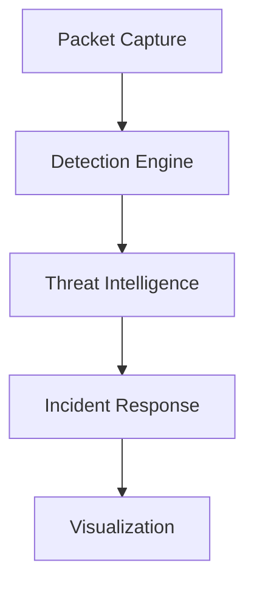

# Network Intrusion Detection System (NIDS) 🛡️

[](https://opensource.org/licenses/MIT)
[](https://isocpp.org/)
[](https://cmake.org/)
[](https://github.com/0x0060/NIDS)
[](https://github.com/0x0060/NIDS/issues)

A sophisticated Network Intrusion Detection System (NIDS) leveraging advanced threat intelligence, machine learning, and real-time monitoring capabilities to protect your network infrastructure.

## 🌟 Key Features

- **Advanced Threat Intelligence**
  - Real-time threat data integration
  - ML-based confidence scoring
  - Quantum-resistant cryptography
  - Blockchain-based threat sharing

- **Intelligent Detection Engine**
  - Machine learning-powered anomaly detection
  - Behavioral analytics
  - Zero-day vulnerability scanning
  - Memory forensics capabilities

- **Real-time Monitoring**
  - Network traffic analysis
  - Distributed monitoring system
  - Automated incident response
  - Real-time visualization

- **Comprehensive Forensics**
  - Network packet capture and analysis
  - Memory forensics integration
  - Automated evidence collection
  - Chain of custody maintenance

## 📋 Prerequisites

- C++17 compatible compiler
- CMake 3.x or higher
- Boost libraries
- OpenSSL
- nlohmann/json
- spdlog
- libcurl

## 🚀 Quick Start

```bash
# Clone the repository
git clone https://github.com/0x0060/NIDS.git

# Create build directory
mkdir build && cd build

# Configure and build
cmake ..
make

# Run the system
./nids
```

## 📚 Documentation

Detailed documentation is available in the [docs](docs/) directory:

- [Architecture Overview](docs/architecture.md)
- [Configuration Guide](docs/configuration.md)
- [Threat Intelligence](docs/threat-intelligence.md)
- [Detection Engine](docs/detection-engine.md)
- [API Reference](docs/api-reference.md)
- [Contributing Guidelines](docs/contributing.md)

## 🔧 Configuration

The system can be configured through the `config/nids_config.json` file. See the [Configuration Guide](docs/configuration.md) for detailed settings.

<details>
<summary>Sample Configuration</summary>

```json
{
  "threat_intelligence": {
    "feeds": [...],
    "update_interval": 3600,
    "cache_ttl": 86400
  },
  "detection_engine": {
    "sensitivity": "high",
    "ml_model_path": "models/"
  }
}
```
</details>

## 🛠️ Architecture

The system is built with a modular architecture:



## 🤝 Contributing

Contributions are welcome! Please read our [Contributing Guidelines](docs/contributing.md) before submitting pull requests.

## 📄 License

This project is licensed under the MIT License - see the [LICENSE](LICENSE) file for details.

## 🙏 Acknowledgments

- [OpenSSL](https://www.openssl.org/)
- [Boost](https://www.boost.org/)
- [nlohmann/json](https://github.com/nlohmann/json)
- [spdlog](https://github.com/gabime/spdlog)

## 📞 Support

For support, please open an issue in the GitHub issue tracker or contact the maintainers.

---

<p align="center">Made with ❤️ for network security</p>
